<div align="center">

# 🦷 DentalGemma

### AI-Powered Dental Diagnostics with Intelligent Agentic Workflows

[](https://dentalgemma.vercel.app)
[](https://huggingface.co/naazimsnh02/dentalgemma-1.5-4b-it)
[](LICENSE)
[](https://nextjs.org/)
[](https://www.typescriptlang.org/)

**Built for the [MedGemma Impact Challenge](https://kaggle.com/competitions/med-gemma-impact-challenge) 🏥**

*Bringing dental diagnostics into the age of medical foundation models*

[Live Demo](https://dentalgemma.vercel.app) • [Model Card](https://huggingface.co/naazimsnh02/dentalgemma-1.5-4b-it) • [Datasets](#datasets) • [Documentation](#documentation)

</div>

---

## 📋 Table of Contents

- [Overview](#-overview)
- [Key Features](#-key-features)
- [Demo Videos](#-demo-videos)
- [Screenshots](#-screenshots)
- [Architecture](#-architecture)
- [Technology Stack](#-technology-stack)
- [Model Details](#-model-details)
- [Datasets](#-datasets)
- [Getting Started](#-getting-started)
- [Project Structure](#-project-structure)
- [Deployment](#-deployment)
- [Challenge Alignment](#-challenge-alignment)
- [Medical Disclaimer](#-medical-disclaimer)
- [License](#-license)
- [Citation](#-citation)
- [Acknowledgments](#-acknowledgments)

---

## 🎯 Overview

**DentalGemma** is a multimodal dental AI diagnostic platform that demonstrates novel domain adaptation of Google's MedGemma foundation model for dental healthcare. The platform combines:

- **Fine-tuned MedGemma 1.5 4B IT** — Specialized for dental diagnostics across 98 clinical conditions
- **Cloud-First Architecture** — GPU-accelerated inference via Modal.com for high accuracy and speed
- **Multi-Agent Diagnostic System** — Intelligent workflow orchestration using Vercel AI SDK 6
- **Voice Consultation** — Web Speech API with DentalGemma
- **Evidence-Based Research** — Integrated PubMed search for clinical guidelines
- **Practical Utility** — Dentist finder, treatment tracking, patient education, and more

### Why DentalGemma?

MedGemma was **not originally trained on dental data**, making this a novel task adaptation. Dental diagnostics remains an underserved domain in medical AI, and DentalGemma bridges this gap by:

1. Curating 5 diverse dental datasets (5,023 total samples)
2. Fine-tuning with full bfloat16 precision LoRA for maximum diagnostic accuracy
3. Building a comprehensive web application with 13 integrated features
4. Deploying on cloud infrastructure for real-world accessibility

---

## ✨ Key Features

### Core AI Capabilities

| Feature | Description | Technology |
|---------|-------------|------------|
| 🔍 **X-Ray Analysis** | Analyze dental radiographs and clinical photographs for pathology detection, cavity assessment, and tooth identification | DentalGemma Multimodal (VQA) |
| 📋 **Clinical Assessment** | Comprehensive diagnostic reports with diagnosis, treatment plans, antibiotic recommendations, and follow-up schedules | DentalGemma Instruct |
| 🎤 **Voice Consultation** | Hands-free clinical queries with real-time transcription and audio responses | Web Speech API |
| 🤖 **Agentic Workflows** | Multi-agent system orchestrating X-ray analysis, research synthesis, and specialist referrals | Vercel AI SDK 6 |

### Additional Features

| Feature | Description |
|---------|-------------|
| 🗺️ **Dentist Finder** | Location-based search for dental specialists with ratings, reviews, and directions |
| 📊 **Treatment Tracker** | Visual progress monitoring with milestones, charts, and cost tracking |
| 🔬 **Research Dashboard** | PubMed integration for evidence-based literature search and citation export |
| 📚 **Patient Education** | Interactive learning portal covering 98 dental conditions with visual aids |
| 🔍 **Symptom Checker** | AI-powered urgency assessment with guided questionnaire |
| 📈 **Analytics Dashboard** | Usage statistics, condition distribution, and activity timeline |
| ℹ️ **Model Information** | Detailed model architecture, training data, and performance metrics |
| ⚙️ **Settings & History** | Customizable preferences and analysis history management |
| 📱 **PWA Support** | Installable app with offline capabilities for key features |

---

## 🎥 Demo Videos

> **Note:** Demo videos will be added here showcasing:
> - Complete platform walkthrough (3 minutes)
> - Agentic workflow demonstration (2 minutes)
> - Feature-specific tutorials

---

## 📸 Screenshots

<div align="center">
  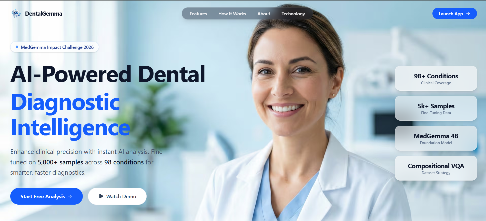
  <p><em>Landing Page & Hero Section</em></p>
</div>

<br/>

| **X-Ray Analysis** | **Clinical Assessment** |
|:---:|:---:|
| 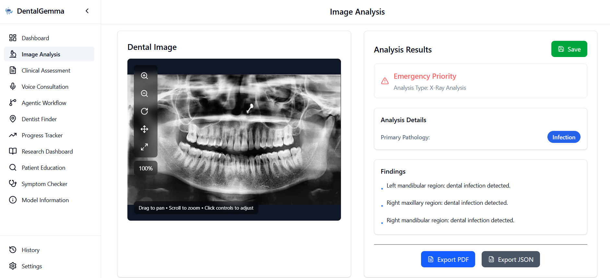 | 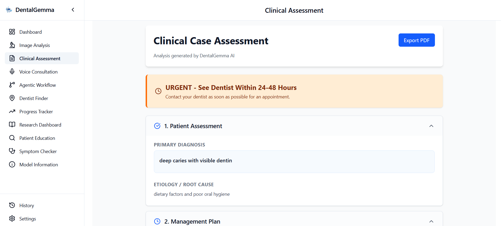 |

| **Voice Consultation** | **Agentic Workflow** |
|:---:|:---:|
| 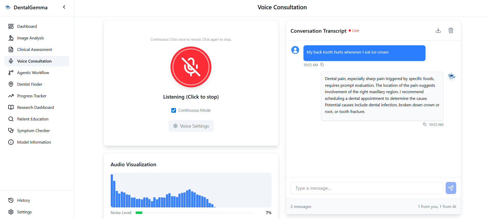 | 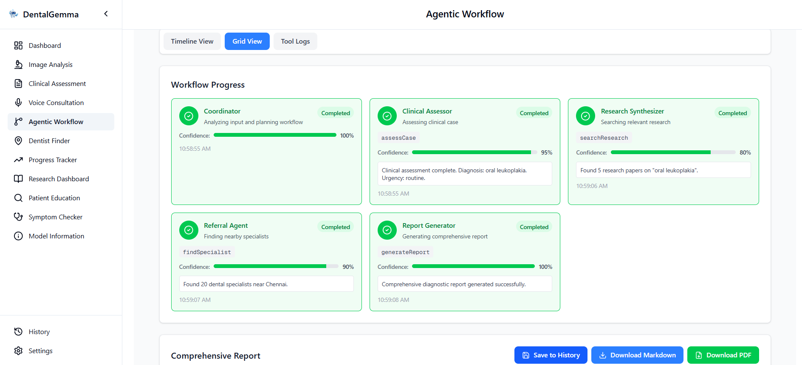 |

| **Dentist Finder** | **Research Dashboard** |
|:---:|:---:|
| 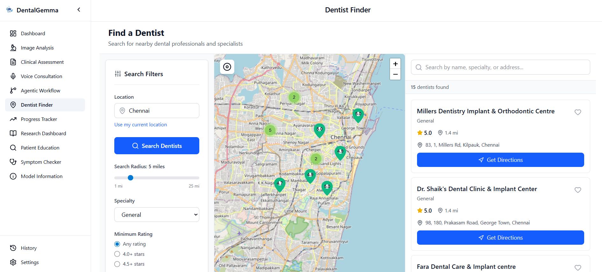 | 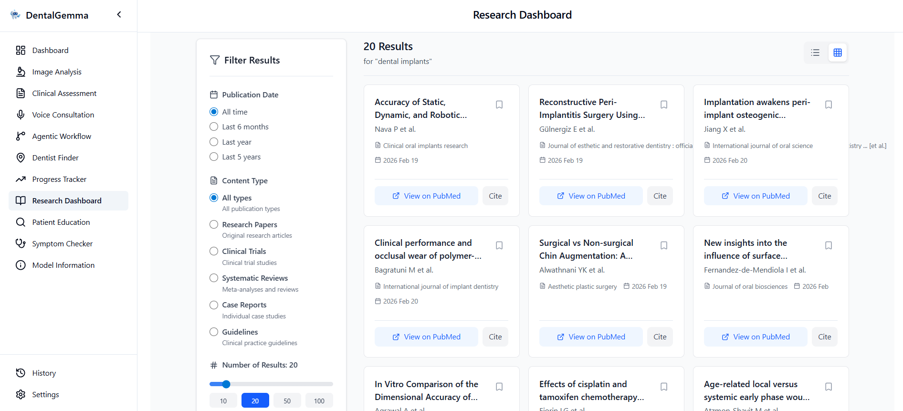 |

| **Patient Education** | **Symptom Checker** |
|:---:|:---:|
| 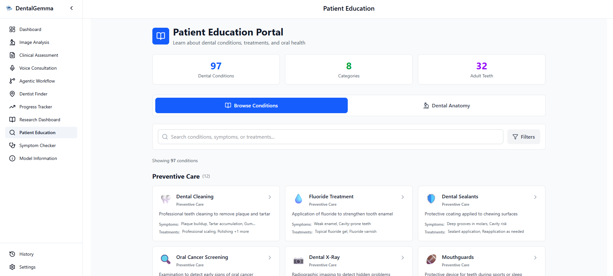 | 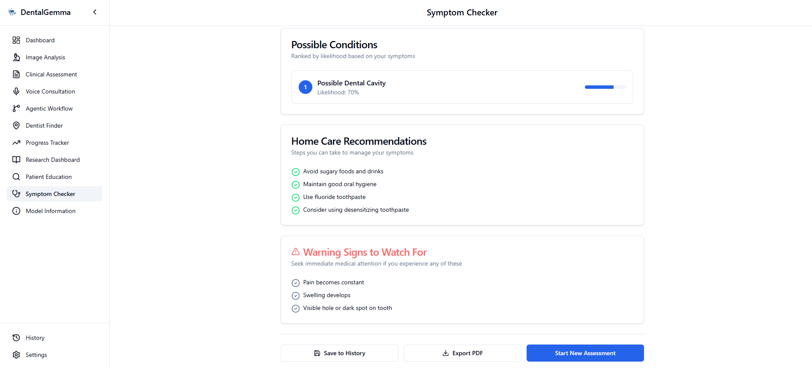 |

| **Progress Tracker** | **Dashboard Overview** |
|:---:|:---:|
| 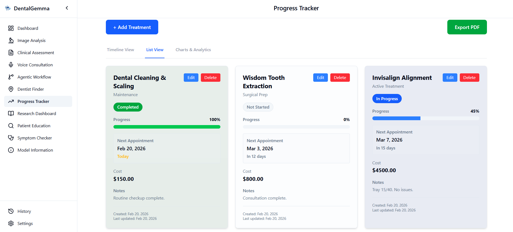 | 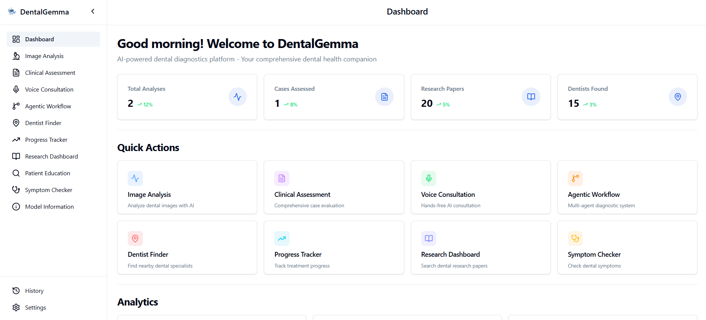 |

| **Image Analysis** | **Model Information** |
|:---:|:---:|
| 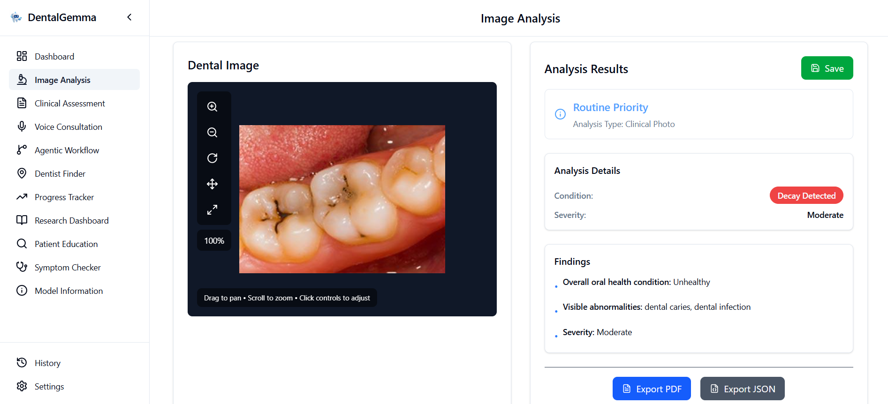 | 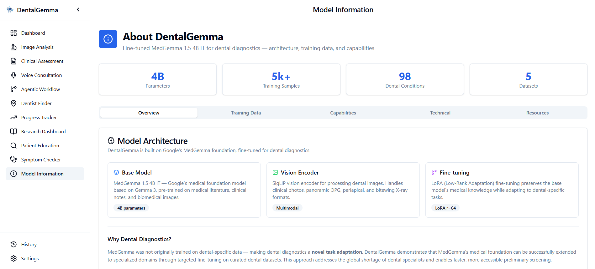 |

---

## 🏗️ Architecture

```
┌─────────────────────────────────────────────────────────────────────┐
│                    FRONTEND (Next.js 16 PWA)                        │
│              Deployed on Vercel · Tailwind v4 · shadcn/ui           │
│                                                                     │
│  ┌──────────┐ ┌──────────┐ ┌──────────┐ ┌──────────┐              │
│  │ X-Ray    │ │ Clinical │ │ Voice    │ │ Agentic  │              │
│  │ Analyzer │ │ Case     │ │ Consult  │ │ Workflow │              │
│  │  (VQA)   │ │ Assess.  │ │ (WebAPI) │ │ Engine   │              │
│  └────┬─────┘ └────┬─────┘ └────┬─────┘ └────┬─────┘              │
│       │             │            │             │                    │
│  ┌────┴─────────────┴────────────┴─────────────┴────────────┐      │
│  │                 AI ENGINE LAYER                          │      │
│  │    ┌──────────────────────────┐                          │      │
│  │    │   Modal.com GPU Backend  │                          │      │
│  │    │   DentalGemma 1.5 4B IT  │                          │      │
│  │    │   (bfloat16 Inference)   │                          │      │
│  │    └──────────────────────────┘                          │      │
│  └──────────────────────────────────────────────────────────┘      │
│                                                                     │
│  ┌──────────┐ ┌──────────┐ ┌──────────┐ ┌──────────┐              │
│  │ Dentist  │ │ Progress │ │ Research │ │ Patient  │              │
│  │ Finder   │ │ Tracker  │ │ Dashboard│ │ Education│              │
│  └──────────┘ └──────────┘ └──────────┘ └──────────┘              │
└─────────────────────────────────────────────────────────────────────┘

┌─────────────────────────────────────────────────────────────────────┐
│                     BACKEND SERVICES                                │
│                                                                     │
│  ┌──────────────────┐                                              │
│  │  Modal.com        │                                              │
│  │  · DentalGemma    │                                              │
│  │    1.5 4B IT      │                                              │
│  │  · GPU: A10G      │                                              │
│  └──────────────────┘                                              │
│                                                                     │
│  ┌──────────────────┐  ┌──────────────────┐                        │
│  │  Google Places    │  │  PubMed E-Utils  │                        │
│  │  API              │  │  (Free)          │                        │
│  └──────────────────┘  └──────────────────┘                        │
└─────────────────────────────────────────────────────────────────────┘
```

## ⚙️ Technology Stack

### Frontend

| Category | Technology | Purpose |
|----------|------------|---------|
| **Framework** | Next.js 16 (App Router) | React framework with server components, Turbopack bundler |
| **Language** | TypeScript 5 | Type safety and developer experience |
| **Styling** | Tailwind CSS v4 | Utility-first CSS with Oxide engine (Rust) |
| **UI Components** | shadcn/ui | Accessible, customizable component library |
| **State Management** | Zustand | Lightweight state management |
| **Charts** | Recharts | React-native charting library |
| **Maps** | Leaflet.js + react-leaflet | Interactive maps with OpenStreetMap tiles |
| **Icons** | Lucide React | Consistent, tree-shakeable icon set |
| **Animations** | Framer Motion | Smooth micro-animations and transitions |
| **Forms** | React Hook Form + Zod | Form validation and performance |
| **Markdown** | react-markdown | Render AI-generated responses |
| **PDF Generation** | jsPDF + html2canvas | Export reports and analyses |

### Backend & APIs

| Service | Technology | Purpose |
|---------|------------|---------|
| **Model Serving** | Modal.com | GPU inference (L40S), serverless, GPU snapshotting |
| **AI Framework** | Vercel AI SDK 6 | Agent abstractions, streaming, type-safe outputs |
| **Voice** | Web Speech API | Browser-native speech recognition and TTS |
| **Location Services** | Google Places API | Dentist finder and location search |
| **Research** | PubMed E-Utils API | Free medical literature search |
| **API Routes** | Next.js API Routes | Serverless functions on Vercel Edge |

### DevOps & Deployment

| Component | Technology |
|-----------|------------|
| **Hosting** | Vercel (Frontend), Modal.com (Backend) |
| **CI/CD** | Vercel Git Integration (auto-deploy on push) |
| **Version Control** | GitHub |
| **Package Manager** | npm |

---

## 🤖 Model Details

### DentalGemma 1.5 4B IT

**Base Model**: [google/medgemma-1.5-4b-it](https://huggingface.co/google/medgemma-1.5-4b-it)  
**Fine-tuned Model**: [naazimsnh02/dentalgemma-1.5-4b-it](https://huggingface.co/naazimsnh02/dentalgemma-1.5-4b-it)

#### Architecture

- **Image Encoder**: SigLIP — processes dental images into visual embeddings
- **Language Model**: Gemma 3 (4B parameters) — generates clinical text responses
- **Modality Fusion**: Cross-attention mechanism for image-text integration
- **Context Length**: 8,192 tokens
- **Vocabulary Size**: 256,000 tokens

#### Training Approach

| Parameter | Value |
|-----------|-------|
| **Method** | LoRA (Low-Rank Adaptation) |
| **Precision** | Full bfloat16 (no quantization) |
| **LoRA Rank** | 64 |
| **LoRA Alpha** | 64 |
| **Target Modules** | All linear layers |
| **Hardware** | NVIDIA A100 (80GB VRAM) |
| **Training Time** | ~8 hours (2 stages) |

#### Two-Stage Fine-Tuning

**Stage 1: VQA Training (Multimodal)**
- Dataset: 2,529 dental image-text pairs
- Training: 5 epochs, early stopping at step 2100
- Best Validation Loss: 0.1585
- Batch Size: 1 per device × 4 gradient accumulation
- Learning Rate: 5e-5 (linear scheduler)

**Stage 2: Instruct Training (Text-only)**
- Dataset: 2,494 clinical case assessments
- Training: 5 epochs, early stopping at step 500
- Best Validation Loss: 0.0224
- Batch Size: 2 per device × 4 gradient accumulation
- Learning Rate: 5e-5 (linear scheduler)

#### Key Capabilities

| Capability | Training Samples | Description |
|------------|------------------|-------------|
| 📸 **Clinical Photo Analysis** | ~642 pairs (418 images) | Cavity detection, oral health assessment, severity evaluation |
| 🏥 **OPG Classification** | ~1,214 pairs (517 images) | 6-class pathology: Healthy, Caries, Impacted, BDC-BDR, Infection, Fractured |
| 📍 **Location-Aware Diagnosis** | ~545 pairs (232 images) | Anatomical region mapping (e.g., "right mandibular region") |
| 🦷 **Dentition Assessment** | ~128 pairs (64 images) | Tooth type identification, completeness evaluation |
| 💊 **Clinical Case Analysis** | 2,494 cases | Diagnosis, treatment planning, antibiotic recommendations for 98 conditions |

---

## 📊 Datasets

### DentalGemma VQA (Multimodal)

🔗 **[naazimsnh02/dentalgemma-vqa](https://huggingface.co/datasets/naazimsnh02/dentalgemma-vqa)**

- **Total Samples**: 2,529 VQA pairs (90/10 train/validation split)
- **Format**: Dental images paired with clinical questions and answers
- **Innovation**: Compositional answer generation ensures high diversity (560+ unique combinations per condition)

**Source Datasets**:

| Dataset | Images | VQA Pairs | Type | Task |
|---------|--------|-----------|------|------|
| [Dental Cavity Detection](https://www.kaggle.com/datasets/maazmakhdoom/dental-cavity-detection-dataset) | 418 | ~642 | Clinical Photos | Cavity/normal detection |
| [Dental OPG Classification](https://www.kaggle.com/datasets/imtkaggleteam/dental-opg-xray-dataset) | 517 | ~1,214 | Panoramic X-rays | 6-class pathology |
| [Panoramic Dental X-ray](https://www.kaggle.com/datasets/orvile/panoramic-dental-xray-dataset) | 64 | ~128 | Panoramic X-rays | Tooth identification |
| [Dental OPG Object Detection](https://www.kaggle.com/datasets/imtkaggleteam/dental-opg-xray-dataset) | 232 | ~545 | Panoramic X-rays | Location-aware diagnosis |

### DentalGemma Instruct (Text-only)

🔗 **[naazimsnh02/dentalgemma-instruct](https://huggingface.co/datasets/naazimsnh02/dentalgemma-instruct)**

- **Total Samples**: 2,494 clinical cases (90/10 train/validation split)
- **Coverage**: 98 unique dental conditions
- **Format**: Structured clinical case presentations with comprehensive assessments
- **Source**: [Wildstash/dental-2.5k-instruct](https://huggingface.co/datasets/Wildstash/dental-2.5k-instruct)

**Case Structure**: Patient demographics, chief complaint, clinical/radiographic findings, medical history, diagnosis, management plan, antibiotic considerations, follow-up recommendations, patient counseling

---

## 🚀 Getting Started

### Prerequisites

- Node.js 20+ and npm
- API keys for:
  - Google Places API (dentist finder)
  - Modal.com (backend inference)

### Installation

1. **Clone the repository**
   ```bash
   git clone https://github.com/naazimsnh02/dentalgemma.git
   cd dentalgemma
   ```

2. **Install frontend dependencies**
   ```bash
   cd dentalgemma-app
   npm install
   ```

3. **Configure environment variables**
   ```bash
   cp .env.local.example .env.local
   ```
   
   Edit `.env.local` and add your API keys:
   ```env
   # Modal.com Backend
   NEXT_PUBLIC_MODAL_ENDPOINT=https://your-modal-endpoint.modal.run
   
   # Google APIs
   NEXT_PUBLIC_GOOGLE_PLACES_API_KEY=your_places_api_key
   
   # Optional: Analytics, monitoring, etc.
   ```

4. **Run the development server**
   ```bash
   npm run dev
   ```
   
   Open [http://localhost:3000](http://localhost:3000) in your browser

5. **Build for production**
   ```bash
   npm run build
   npm start
   ```

### Backend Deployment (Modal.com)

1. **Install Modal CLI**
   ```bash
   pip install modal
   modal token new
   ```

2. **Deploy the DentalGemma backend**
   ```bash
   cd scripts
   modal deploy modal_dentalgemma.py
   ```
   
   Copy the endpoint URL and add it to your `.env.local` as `NEXT_PUBLIC_MODAL_ENDPOINT`

3. **Test the deployment**
   ```bash
   modal app list
   ```

---

## 📁 Project Structure

```
dentalgemma/
├── dentalgemma-app/              # Next.js frontend application
│   ├── app/                      # Next.js App Router
│   │   ├── (dashboard)/          # Dashboard pages (13 features)
│   │   ├── api/                  # API routes
│   │   ├── page.tsx              # Landing page
│   │   └── layout.tsx            # Root layout
│   ├── components/               # React components
│   │   ├── ui/                   # shadcn/ui components
│   │   ├── xray/                 # X-ray analysis components
│   │   ├── case/                 # Clinical assessment components
│   │   ├── voice/                # Voice consultation components
│   │   ├── agentic/              # Agentic workflow components
│   │   ├── dentist/              # Dentist finder components
│   │   ├── research/             # Research dashboard components
│   │   ├── education/            # Patient education components
│   │   ├── dashboard/            # Analytics dashboard components
│   │   ├── landing/              # Landing page components
│   │   └── layout/               # Layout components
│   ├── lib/                      # Utility functions and API clients
│   │   ├── api/                  # API client modules
│   │   ├── agentic/              # Agent coordination logic
│   │   └── voice/                # Voice system utilities
│   ├── hooks/                    # Custom React hooks
│   ├── store/                    # Zustand state management
│   ├── types/                    # TypeScript type definitions
│   ├── __tests__/                # Automated testing suite
│   ├── scripts/                  # Utility scripts
│   ├── public/                   # Static assets and PWA files
│   ├── jest.config.js            # Test configuration
│   └── vercel.json               # Vercel deployment config
├── finetune/                     # Model fine-tuning pipeline
│   ├── preprocessing/            # Data preprocessing scripts
│   │   ├── build_dataset.py      # Main dataset builder
│   │   ├── process_*.py          # Dataset-specific processors
│   │   ├── answer_builder.py     # Compositional answer generation
│   │   └── inspect_dataset.py    # Dataset inspection utility
│   ├── datasets/                 # Raw source datasets (not tracked)
│   ├── output/                   # Built datasets (not tracked)
│   └── *.ipynb                   # Training & validation notebooks
├── scripts/                      # Deployment and utility scripts
│   └── modal_dentalgemma.py      # Modal.com backend deployment
└── README.md                     # This file
```

---

## 🌐 Deployment

### Frontend (Vercel)

1. **Connect repository to Vercel**
   - Import your GitHub repository
   - Select `dentalgemma-app` as the root directory
   - Framework preset: Next.js

2. **Configure environment variables**
   - Add all variables from `.env.local` in Vercel dashboard
   - Ensure `NEXT_PUBLIC_*` variables are properly prefixed

3. **Deploy**
   - Vercel automatically deploys on every push to main branch
   - Preview deployments for pull requests

### Backend (Modal.com)

1. **Set up Modal secrets**
   ```bash
   modal secret create huggingface-secret HF_TOKEN=your_huggingface_token
   ```

2. **Deploy the model endpoint**
   ```bash
   cd scripts
   modal deploy modal_dentalgemma.py
   ```

---

## 🏆 Challenge Alignment

### MedGemma Impact Challenge Tracks

| Track | Evidence |
|-------------|----------|
| **🏆 Main Track** | Production-ready application with 13 integrated features, professional deployment, comprehensive documentation |
| **🏆 Novel Task** | MedGemma not originally trained on dental data; 4 datasets curated, 5,023 samples, dual VQA + Instruct fine-tuning, 98 dental conditions |
| **🏆 Agentic Workflow** | Vercel AI SDK 6 multi-agent system with 6-step autonomous diagnostic pipeline, transparent reasoning, tool calling |

### Evaluation Criteria Coverage

| Criterion | Weight | How DentalGemma Addresses It |
|-----------|--------|------------------------------|
| **Effective use of HAI-DEF models** | 20% | Fine-tuned MedGemma 1.5 4B IT for novel dental domain with 5,023 samples. Cloud deployment via Modal.com demonstrating effective model serving. |
| **Problem domain** | 15% | Clear dental diagnostic workflow improvement. Reduces diagnostic time, automates complex multi-step workflows, improves accessibility for underserved areas. |
| **Impact potential** | 15% | Free web-based PWA accessible globally. Offline capability for key resources. Educational tool for dental students and professionals. |
| **Product feasibility** | 20% | Production deployment on Vercel + Modal.com. 13 integrated features. Real external APIs. Professional UI. Performance optimized. PWA installable. |
| **Execution & communication** | 30% | Professional demo videos, comprehensive documentation, clean codebase, user-friendly interface, technical innovation across all tracks. |

---

## ⚠️ Medical Disclaimer

**IMPORTANT**: This application is for educational, research, and demonstration purposes only. It is **NOT** intended for clinical diagnosis or patient care.

- All AI-generated assessments must be validated by licensed dental professionals
- Not a substitute for professional medical advice, diagnosis, or treatment
- Always seek the advice of qualified health providers with any questions regarding medical conditions

---

## 📜 License

This project is licensed under the Apache License 2.0 - see the [LICENSE](LICENSE) file for details.

### Component Licenses

- **Model**: Apache 2.0
- **Base Model (MedGemma)**: [Gemma Terms of Use](https://ai.google.dev/gemma/terms)
- **Training Datasets**: See individual dataset licenses (CC BY-SA 4.0, CC BY-NC-SA 4.0, Apache 2.0)

---

## 📚 Citation

If you use DentalGemma in your research or project, please cite:

```bibtex
@misc{dentalgemma2026,
  title={DentalGemma: Fine-tuning MedGemma for Dental Diagnostics},
  author={Naazim},
  year={2026},
  publisher={HuggingFace},
  howpublished={\url{https://github.com/naazimsnh02/dentalgemma}},
  note={MedGemma Impact Challenge submission}
}
```

**Base Model Citation:**
```bibtex
@misc{medgemma2024,
  title={MedGemma: Medical Foundation Models from Google Health},
  author={Google Health AI},
  year={2024},
  publisher={HuggingFace},
  howpublished={\url{https://huggingface.co/google/medgemma-1.5-4b-it}}
}
```

**Challenge Citation:**
```bibtex
@misc{medgemma-impact-challenge,
  author={Fereshteh Mahvar and Yun Liu and Daniel Golden and others},
  title={The MedGemma Impact Challenge},
  year={2026},
  howpublished={\url{https://kaggle.com/competitions/med-gemma-impact-challenge}}
}
```

---

## 🙏 Acknowledgments

- **Google Health AI** for releasing MedGemma and organizing the Impact Challenge
- **Dataset creators** for providing high-quality dental imaging and clinical data:
  - [Dental Cavity Detection Dataset](https://www.kaggle.com/datasets/maazmakhdoom/dental-cavity-detection-dataset)
  - [Dental OPG X-ray Dataset](https://www.kaggle.com/datasets/imtkaggleteam/dental-opg-xray-dataset)
  - [Panoramic Dental X-ray Dataset](https://www.kaggle.com/datasets/orvile/panoramic-dental-xray-dataset)
  - [dental-2.5k-instruct](https://huggingface.co/datasets/Wildstash/dental-2.5k-instruct)
- **HuggingFace** for the Transformers, TRL, and PEFT libraries
- **Vercel** for hosting and deployment infrastructure
- **Modal.com** for GPU inference infrastructure
- **Kaggle** for hosting the competition platform

---

## 🔗 Links

- **Live Demo**: [dentalgemma.vercel.app](https://dentalgemma.vercel.app)
- **Model**: [naazimsnh02/dentalgemma-1.5-4b-it](https://huggingface.co/naazimsnh02/dentalgemma-1.5-4b-it)
- **VQA Dataset**: [naazimsnh02/dentalgemma-vqa](https://huggingface.co/datasets/naazimsnh02/dentalgemma-vqa)
- **Instruct Dataset**: [naazimsnh02/dentalgemma-instruct](https://huggingface.co/datasets/naazimsnh02/dentalgemma-instruct)
- **Base Model**: [google/medgemma-1.5-4b-it](https://huggingface.co/google/medgemma-1.5-4b-it)
- **Competition**: [MedGemma Impact Challenge](https://kaggle.com/competitions/med-gemma-impact-challenge)

---

<div align="center">

**Built with ❤️ for the MedGemma Impact Challenge**

*Advancing dental healthcare through AI innovation*

[](https://github.com/naazimsnh02/dentalgemma)

</div>
